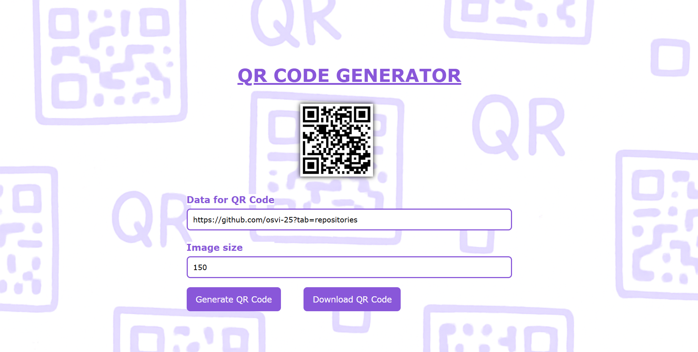

# React QR Code Generator

A simple QR Code generator built with **React**.  
It allows users to enter text/URLs and instantly generate a QR code, with an option to download it.

## 🚀 Features
- Generate QR codes from text or URLs
- Customize QR code size
- Download QR code as an image
- Built with **React Hooks**

## 📸 Preview


## 🛠️ Technologies Used
- React
- QRServer API

## 📦 Installation
```bash
git clone https://github.com/osvi-25/react-qrcode-generator.git
cd react-qrcode-generator
npm install
npm start
```

## 🧑‍💻 Usage

1. **Enter** any text or URL in the input field.  
2. **Click Generate QR** to create your QR code.  
3. **Click Download** to save it as a PNG image.
