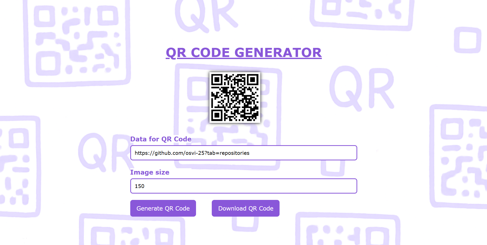

# React QR Code Generator

A simple QR Code generator built with **React**.  
It allows users to enter text/URLs and instantly generate a QR code, with an option to download it.

## Live Demo
Check out the live version of this project [here](https://react-qrcode-generator-chi.vercel.app/).

## 🚀 Features
- Generate QR codes from text or URLs
- Customize QR code size
- Download QR code as an image
- Built with **React Hooks**

## 📸 Preview


## 🛠️ Technologies Used
- **React.js**  
- **JavaScript**  
- **HTML5**  
- **CSS3**  
- **Vite**
- **QRServer API**
- **Postman**
- **Prettier**

## 📦 Installation
```bash
git clone https://github.com/osvi-25/react-qrcode-generator.git
cd react-qrcode-generator
npm install
npm start
```

## 🧑‍💻 Usage

1. **Enter** any text or URL in the input field.  
2. **Click Generate QR** to create your QR code.  
3. **Click Download** to save it as a PNG image.
